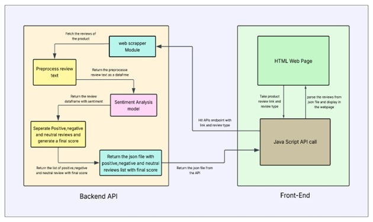

<div align="center">
  
</div>
<h1 align="center" style="font-weight: 900; font-family: 'Segoe UI', Tahoma, Geneva, Verdana, sans-serif; color: #1e90ff; text-shadow: 2px 2px 4px rgba(0,0,0,0.2);">
  Flipkart Product Review Analyzer AI
</h1>

<p>
<strong>Tired of scrolling through endless product reviews? This tool does the heavy lifting for you! The Flipkart Product Review Analyzer is a web application that scrapes product reviews from Flipkart, analyzes the sentiment behind them, and presents a clear, visual summary.</strong>
</p>

<!-- Badges -->

<p>
<a href="https://github.com/a3x-parvez/flipkart_review_sentiment_web/actions"></a>
<a href="https://github.com/a3x-parvez/flipkart_review_sentiment_web/blob/main/LICENSE"></a>
<a href="https://github.com/a3x-parvez/flipkart_review_sentiment_web/issues"></a>
<a href="https://github.com/a3x-parvez/flipkart_review_sentiment_web/stargazers"></a>
</p>
</div>

## 🌊 Workflow
This diagram illustrates the flow of data from the user to the final analysis:

<div align="center">

</div>


## ✨ Features
<details>
<summary><strong>Click to expand features</strong></summary>

- 🌐 **Real-time Web Scraping** 
  - Fetches the latest reviews for any Flipkart product in real-time.

- 🧠 **Advanced Sentiment Analysis**  
  - Utilizes a powerful, pre-trained BERT model to accurately  classify reviews as **positive**, **negative**, or **neutral**.

- 💻 **Interactive Frontend**  
  - A user-friendly interface to input product URLs and view the analysis.

- 📊 **Data Visualization**  
  - Displays a **pie chart** for an at-a-glance understanding of the overall sentiment.

- 📂 **Categorized Reviews**  
  - Neatly organizes comments into **positive**, **neutral**, and **negative** sections for easy reading.

- 🌙 **Dark Mode**  
  - A sleek dark mode for comfortable viewing.

</details>


## 🛠️ Tech Stack

<details>
<summary><strong>Frontend</strong></summary>

- **HTML** – Structure of the web pages  
- **CSS** – Styling and layout  
- **JavaScript** – Interactivity and dynamic content  

</details>

<details>
<summary><strong>Backend</strong></summary>

- **Python** – Core programming language  
- **Flask** – Lightweight web framework  
- **Gunicorn** – WSGI server for deploying Flask apps  

</details>

<details>
<summary><strong>Libraries</strong></summary>

- **BeautifulSoup4 & Requests** – Web scraping  
- **Pandas** – Data manipulation and analysis  
- **NLTK** – Natural language processing  
- **TensorFlow & Transformers** – Sentiment analysis model (BERT-based)  

</details>

<br>

## 🗂️ Project Structure
```
.
├── Backend_API
│   ├── 3_epoch_sentiment_model
│   ├── 8_epoch_sentiment_model
│   ├── Main_functions.py
│   ├── requirements.txt
│   ├── Sentiment_API.py
│   └── s_models.py
├── Product_Analysis_Frontend
│   ├── img_vid_gifs
│   ├── index.html
│   ├── main.js
│   ├── script.js
│   └── style.css
├── .gitignore
├── LICENSE
└── README.md

```
---

🤖 Model Details
The sentiment analysis is powered by a BERT (Bidirectional Encoder Representations from Transformers) model. Specifically, this project uses a pre-trained bert-base-uncased model that has been fine-tuned for sequence classification. The model has been trained for 8 epochs to achieve higher accuracy in classifying sentiment.

🏁 Getting Started
To get a local copy up and running, follow these simple steps.

Prerequisites
Python 3.x

pip

Installation
Clone the repo

git clone https://github.com/a3x-parvez/flipkart_review_sentiment_web.git

Navigate to the Backend_API directory

cd flipkart_review_sentiment_web/Flipkart_Review_Sentiment_Web-2b92e41e611a08edcfb580abf461db866e51524/Backend_API

Install Python packages

pip install -r requirements.txt

Run the Flask API

python Sentiment_API.py

Open the frontend

Navigate to the Product_Analysis_Frontend directory.

Open the index.html file in your browser.

🎈 Usage
Find a product on Flipkart and go to its reviews page.

Copy the URL.

Paste the URL into the input box in the web app.

Select whether the page contains single or multiple reviews.

Click "Analyze" and watch the magic happen!

🤝 Contributing
Contributions are what make the open-source community such an amazing place to learn, inspire, and create. Any contributions you make are greatly appreciated.

Fork the Project

Create your Feature Branch (git checkout -b feature/AmazingFeature)

Commit your Changes (git commit -m 'Add some AmazingFeature')

Push to the Branch (git push origin feature/AmazingFeature)

Open a Pull Request

📜 License
This project is licensed under the MIT License. See the LICENSE file for more information.

<div align="center">
Built with ❤️ by chayan ghosh
</div>