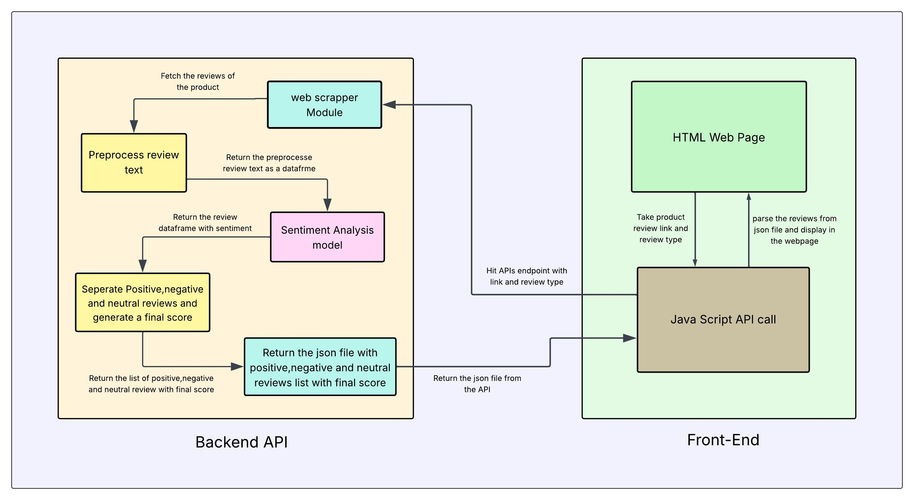

<div align="center">
  

  <h1 style="font-weight: 900; font-family: 'Segoe UI', Tahoma, Geneva, Verdana, sans-serif; color: #1e90ff; text-shadow: 2px 2px 4px rgba(0,0,0,0.2);">
    Flipkart Product Review Analyzer AI 
  </h1>
  <p>
    <strong>Tired of scrolling through endless product reviews? This tool does the heavy lifting for you! The Flipkart Product Review Analyzer is a web application that scrapes product reviews from Flipkart, analyzes the sentiment behind them, and presents a clear, visual summary.</strong>
  </p>

  <!-- Badges -->
  <p>
    <a href="https://github.com/a3x-parvez/flipkart_review_sentiment_web/blob/main/LICENSE"></a>
    <a href="https://github.com/a3x-parvez/flipkart_review_sentiment_web/issues"></a>
    <a href="https://github.com/a3x-parvez/flipkart_review_sentiment_web/stargazers"></a>
  </p>
</div>

## 👤 Author
<!-- Add this in your HTML <head> to load the font -->
<link href="https://fonts.googleapis.com/css2?family=Pacifico&display=swap" rel="stylesheet">

<div align="center">
  <h2 style="font-family: 'Pacifico', cursive; font-size: 2.2em; color: #ff6d1eff; text-shadow: 2px 2px 4px rgba(0,0,0,0.2);">
  Rijwanool Karim
</h2>
  <p style ="font-weight: 900; font-family: 'Segoe UI', Tahoma, Geneva, Verdana, sans-serif; color: #651effff; text-shadow: 2px 2px 4px rgba(0,0,0,0.2); font-size: 1.2em">AIML Developer & AI Enthusiast</p>
  <p align="center" style="margin-top: 10px;">
  <a href="https://github.com/a3x-parvez" target="_blank" style="margin: 0 10px;">
    
  </a>
  <a href="https://www.linkedin.com/in/rijwanool-karim" target="_blank" style="margin: 0 10px;">
    
  </a>
  <a href="https://my-portfolio-2-alpha-sandy.vercel.app/" target="_blank" style="margin: 0 10px;">
    
  </a>
</p>

</div>


---

## 🌊 Workflow

This diagram illustrates the flow of data from the user to the final analysis:

<div align="center">

</div>

---

## ✨ Features

<details>
  <summary><strong>Click to expand features</strong></summary>

- 🌐 **Real-time Web Scraping**: Fetches the latest reviews for any Flipkart product in real-time.
- 🧠 **Advanced Sentiment Analysis**: Utilizes a powerful, pre-trained BERT model to accurately classify reviews as **positive**, **negative**, or **neutral**.
- 💻 **Interactive Frontend**: A user-friendly interface to input product URLs and view the analysis.
- 📊 **Data Visualization**: Displays a **pie chart** for an at-a-glance understanding of the overall sentiment.
- 📂 **Categorized Reviews**: Neatly organizes comments into **positive**, **neutral**, and **negative** sections for easy reading.
- 🌙 **Dark Mode**: A sleek dark mode for comfortable viewing.
</details>

---

## 🛠️ Tech Stack

<details>
  <summary><strong>Frontend</strong></summary>

- **HTML**: Structure of the web pages
- **CSS**: Styling and layout
- **JavaScript**: Interactivity and dynamic content
</details>

<details>
  <summary><strong>Backend</strong></summary>

- **Python**: Core programming language
- **Flask**: Lightweight web framework
- **Gunicorn**: WSGI server for deploying Flask apps
</details>

<details>
  <summary><strong>Deep Learning / NLP</strong></summary>

- **BERT (Bidirectional Encoder Representations from Transformers)**
- **RNN, LSTM, BiLSTM (with Glove, Word2Vec, Doc2Vec embeddings)**
- **TensorFlow GPU: Model training acceleration**
- **NLTK, spaCy: Text preprocessing**
</details>

<details>
  <summary><strong>Libraries</strong></summary>

- **BeautifulSoup4 & Requests**: Web scraping
- **Pandas**: Data manipulation and analysis
- **NLTK**: Natural language processing
- **TensorFlow & Transformers**: Sentiment analysis model (BERT-based)
</details>

<br>

---

## 🗂️ Project Structure

```
.
├── Backend_API
│   ├── 3_epoch_sentiment_model
│   ├── 8_epoch_sentiment_model
│   ├── Main_functions.py
│   ├── requirements.txt
│   ├── Sentiment_API.py
│   └── s_models.py
├── Product_Analysis_Frontend
│   ├── img_vid_gifs
│   ├── index.html
│   ├── main.js
│   ├── script.js
│   └── style.css
├── .gitignore
├── LICENSE
└── README.md
```

---

## 🤖 Model Details

**The sentiment analysis is powered by a BERT (Bidirectional Encoder Representations from Transformers) model. Specifically, this project uses a pre-trained `bert-base-uncased` model that has been fine-tuned for sequence classification. The model has been trained for 8 epochs to achieve higher accuracy in classifying sentiment.**

---
## ⚙️ Model Comparison

| Model  | Embedding | Accuracy | Validation Accuracy | Conclusion                                   |
|---------|------------|-----------|---------------------|---------------------------------------------|
| RNN     | Glove      | 40%       | 40%                 | Underfit                                    |
| LSTM    | Glove      | 41%       | 40%                 | Underfit                                    |
| BiLSTM  | Glove      | 92%       | 90%                 | Good paper accuracy, weak test performance  |
| BiLSTM  | Doc2Vec    | 94%       | 91%                 | High accuracy, but biased                   |
| BERT    | BERT       | 96.96%    | 91.03%              | Best performance overall                    |

---

## 🏁 Getting Started

To get a local copy up and running, follow these simple steps.

### Prerequisites

- Python 3.x
- pip

### Installation

1.  **Clone the repo**
    ```sh
    git clone https://github.com/A3x-parvez/Flipkart_Review_Sentiment_Web.git
    ```
2.  **Navigate to the Backend_API directory**
    ```sh
    cd Flipkart_Review_Sentiment_Web/Backend_API
    ```
3.  **Install Python packages**
    ```sh
    pip install -r requirements.txt
    ```
4.  **Run the Flask API**
    ```sh
    python Sentiment_API.py
    ```
5.  **Open the frontend**
    - Navigate to the `Product_Analysis_Frontend` directory.
    - Open the `index.html` file in your browser.

---

## 🎈 Usage

1.  Find a product on Flipkart and go to its reviews page.
2.  Copy the URL.
3.  Paste the URL into the input box in the web app.
4.  Select whether the page contains single or multiple reviews.
5.  Click "Analyze" and watch the magic happen!

---

## 🤓 Future Scope

1. Upgrade BERT to a larger variant
2. Enhance UI/UX design
3. Add product recommendations
4. Improve API response speed
5. Introduce Trending Products feature

---

## 🤝 Project Contributors  

Our project was brought to life by a passionate group of Computer Science Engineers — specializing in Artificial Intelligence, Machine Learning, and Full Stack Development.  
Each member played a crucial role in shaping different aspects of this project, from data to deployment 🚀  

---

#### **⭐ Chayan Ghosh (CSE – AI & ML)** [](https://github.com/CGhosh81)  
  - **Role in this project :**
      *Took charge of the entire model development pipeline process — including deep learning model training and testing, help to integrating models into the API. Ensured the models were robust, accurate, and seamlessly connected to the system for smooth functionality. Also help to collecting datasets manually using web scraping.*

#### **⭐ Rijwanool Karim (CSE – AI & ML)** [](https://github.com/A3x-parvez)  
  - **Role in this project :**
      *Architected the complete project workflow and system architecture - including backend-frontend integration, API design-development, and building the complete backend workflow. Built a fully functional, scalable pipeline and workflow .Also assisted in manual data collection using web scraping to support the pipeline.*

#### **⭐ Shouryadip Bera (CSE)** [](https://github.com/sourya047)  
  - **Role in this project :**
      *Led the frontend web UI design and development, creating a visually appealing and user-friendly interface. Assisted in backend integration, ensuring smooth communication between frontend and backend modules. Focused on building a cohesive, functional interface that made the system intuitive and responsive for users.*

#### **⭐ Sk Mahiduzzaman (CSE – AI & ML)** [](https://github.com/zahir2003)  
  - **Role in this project :**
       *Oversaw data validation and preprocessing, manually checking and correcting datasets to ensure high quality. Cleaned and structured the data so that the deep learning models could train on accurate, reliable inputs, significantly improving model performance.* 

#### **⭐ Sayantan Saha (CSE)** [](https://github.com/Sayantan719)
  - **Role in this project :**
      *Focused on meticulous data validation and cleaning, manually correcting errors and structuring the dataset. Ensured the integrity of data used for model training, enabling the team to produce accurate and consistent results*
   
---
## 🧩 References

- Adarsh Kumar, K N Ganesh – Sentiment Analysis on Flipkart
- Medium, Arsha – NLP Preprocessing
- TechTarget – BERT Language Model
- PapersWithCode – Bidirectional LSTM

---

## 📜 License

This project is licensed under the MIT License. See the `LICENSE` file for more information.


<div align="center">
  Built with ❤️ by Rijwanool Karim <span style="margin: 0 5px;">in collaboration with</span> Chayan Ghosh
</div>

